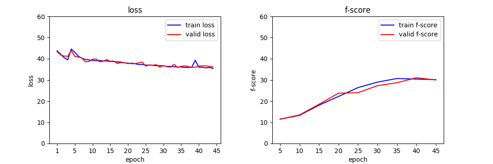
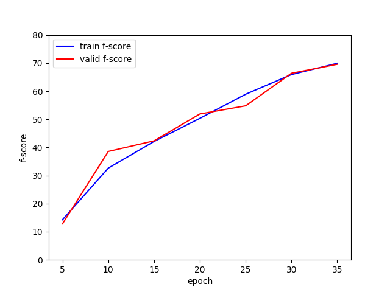

## To-do list:
- [x] Compute fscore in training phase
- [x] Save highest loss images
- [x] MobileNet Backbone
- [ ] Attention CNN (WIP)
- [ ] Understand [Transformer](https://github.com/vinsis/math-and-ml-notes/blob/master/notebooks/Transformer%20-%20Illustration%20and%20code.ipynb)

## Set Up
Install environment
```
$ virtualenv --python=python3.6 venv
$ source venv/bin/activate
(venv) $ pip install -r requirements.txt 
```

## Usage
Training
```
(venv) $ python train.py -c configs/test.json
```

Evaluate
```
(venv) $ python eval.py -c configs/test.json
```

## Plot figs

